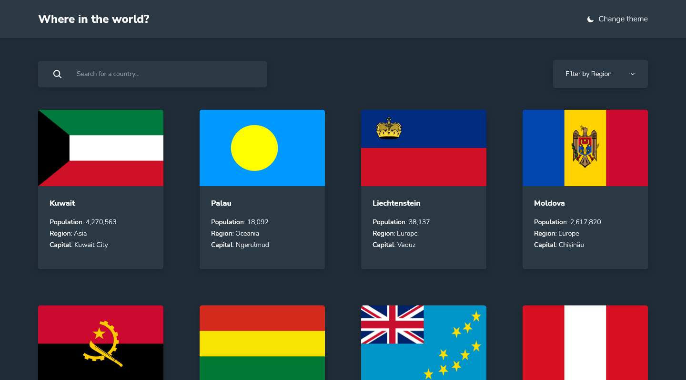

# REST Countries

## Challenge

Users of this page should be able to:

Users should be able to:

- See all countries from the API on the homepage
- Search for a country using an `input` field
- Filter countries by region
- Click on a country to see more detailed information on a separate page
- Click through to the border countries on the detail page
- Toggle the color scheme between light and dark mode

### Links

- [Solution](https://www.frontendmentor.io/solutions/rest-countries-using-react-m_qtWASFfd)
- [Live Site](https://peaceful-flan-6507db.netlify.app/)

### Built with

- React JS
- Flexbox
- CSS Grid
- CSS custom properties
- Desktop-first workflow

## Author

- Frontend Mentor [@Isaiah-B](https://www.frontendmentor.io/profile/Isaiah-B)
